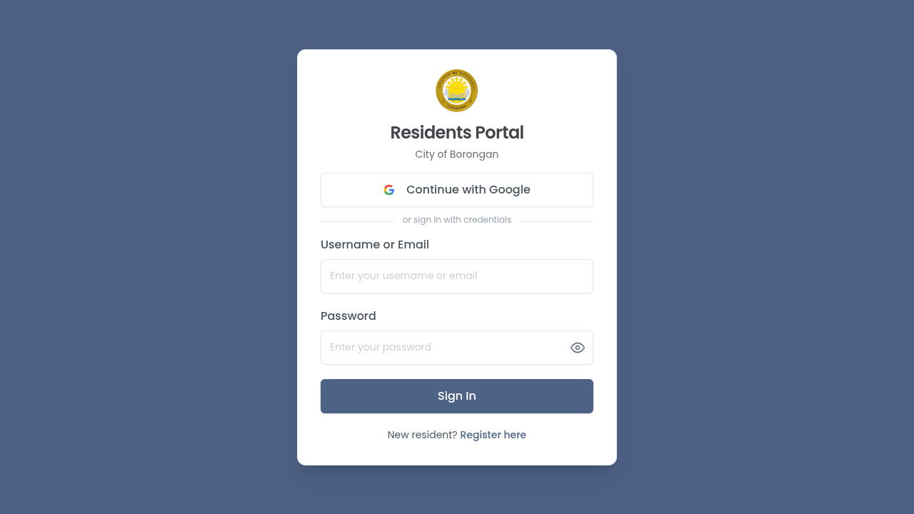
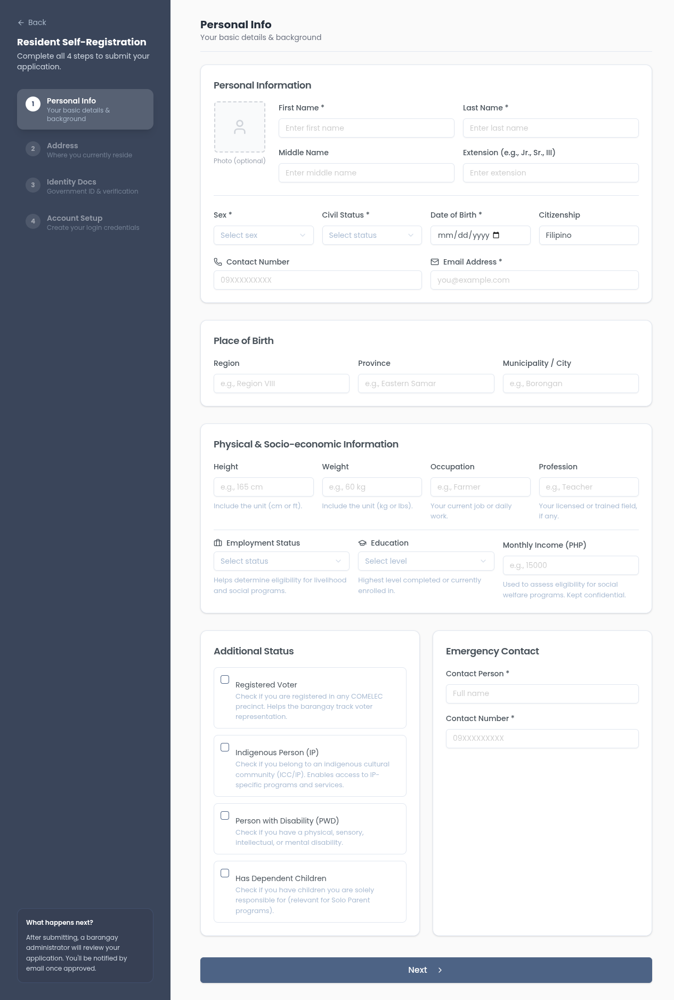
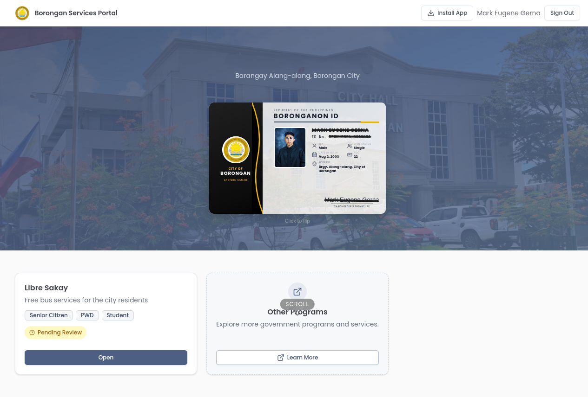
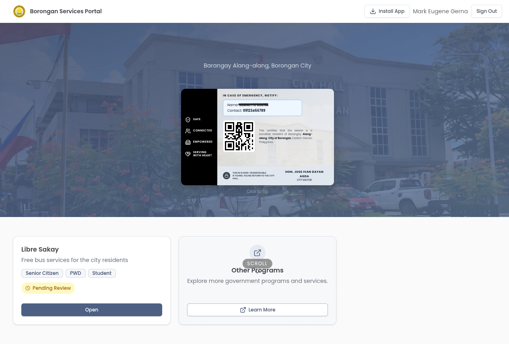
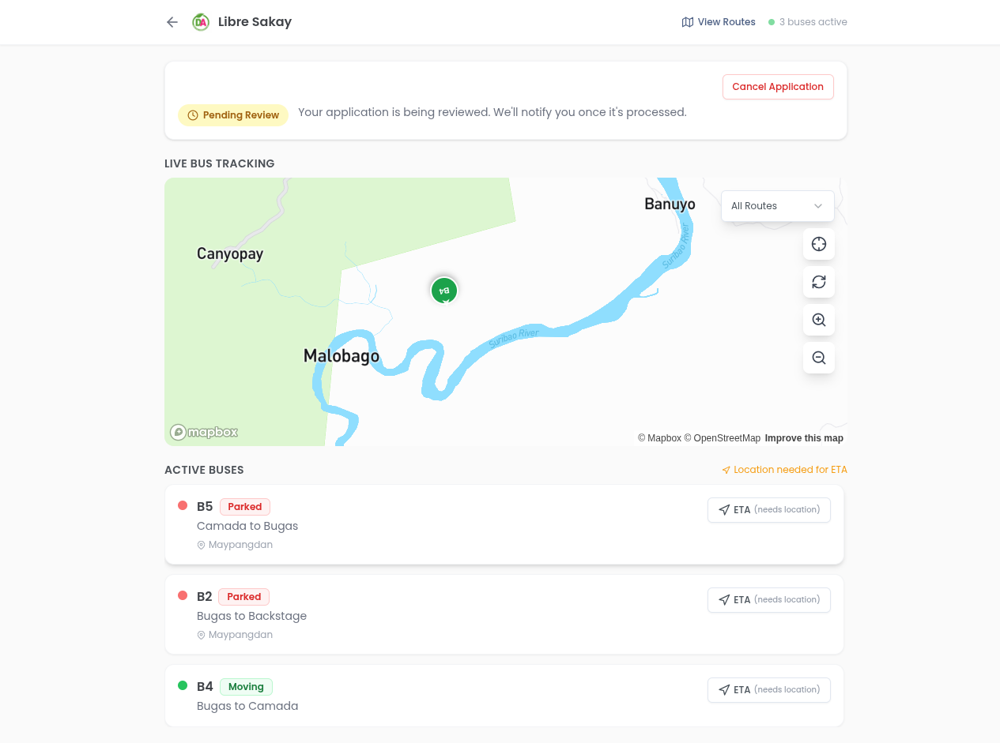
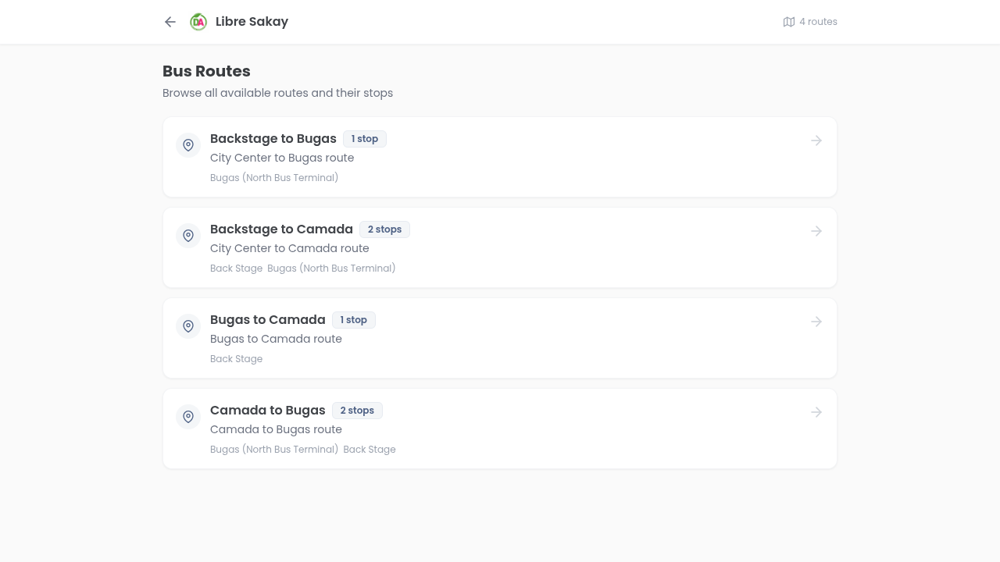
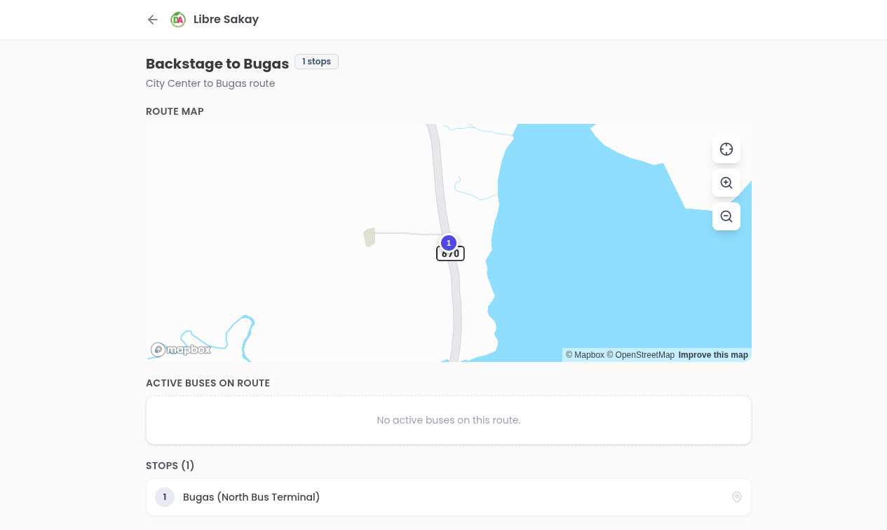

# Borongan Residents Portal — User Guide

A complete guide to **portal.borongancity.com**: registration, signing in, your resident ID, and using the available city programs.

## Contents

1. [Before You Start](#before-you-start)
2. [Registration](#getting-to-the-registration-form)
   - Step 1 — Personal Info
   - Step 2 — Address
   - Step 3 — Identity Documents
   - Step 4 — Account Setup
3. [Signing In](#signing-in)
4. [Home / Resident ID](#home--resident-id)
5. [Libre Sakay (Free Bus Service)](#libre-sakay--free-bus-service)
6. [Other Programs](#other-programs)
7. [Common Issues](#common-issues)
8. [Field Reference](#field-reference-summary)

---

## Before You Start

You will need:

- A **valid email address** (used for login + approval notifications)
- A **government-issued ID** (image file — JPG/PNG)
- **3–5 minutes** of uninterrupted time
- Optional: a **selfie photo** holding your ID

The form has **4 steps**. You cannot skip steps — each must be completed in order. Required fields are marked with **\***.

> **Tip:** Have your ID ready as a photo on your phone or computer before starting Step 3.

---

## Getting to the Registration Form

1. Go to **https://portal.borongancity.com**
2. You will land on the **Sign In** page
3. Click the **Register here** link (bottom of the form)



---

## Step 1 — Personal Info

Enter your basic identity, contact, and socio-economic details.



### Sections

#### Personal Information

| Field | Required | Notes |
|-------|----------|-------|
| Photo | optional | Click the avatar to upload |
| First Name | **yes** | letters, spaces, hyphens, apostrophes only |
| Last Name | **yes** | same rules as First Name |
| Middle Name | no | |
| Extension | no | e.g. Jr., Sr., III |
| Sex | **yes** | Male / Female |
| Civil Status | **yes** | Single / Married / Widowed / Separated / Divorced / Live-in / Annulled |
| Date of Birth | **yes** | must be in the past, on or after 1900-01-01 |
| Citizenship | no | defaults to "Filipino" |
| Contact Number | no | format: `09XXXXXXXXX` |
| Email Address | **yes** | valid email — used for login + approval notice |

#### Place of Birth

Region, Province, Municipality / City — all **optional**, free text.

#### Physical & Socio-economic Information

| Field | Notes |
|-------|-------|
| Height | numeric + unit (e.g. `165 cm`, `5 ft`) |
| Weight | numeric + unit (e.g. `60 kg`, `130 lbs`) |
| Occupation | your current job or daily work |
| Profession | your licensed or trained field |
| Employment Status | Employed / Unemployed / Self-employed / Student / Retired |
| Education | highest level completed or currently enrolled |
| Monthly Income (PHP) | used for social welfare eligibility — **kept confidential** |

#### Additional Status (checkboxes)

- **Registered Voter** — tick if registered with COMELEC
- **Indigenous Person (IP)** — tick if you belong to an ICC/IP community
- **Person with Disability (PWD)** — tick if you have a physical, sensory, intellectual, or mental disability
- **Has Dependent Children** — tick if you are solely responsible for any children (Solo Parent programs)

> **Tip:** Ticking a status may reveal sub-fields (e.g. PWD → disability type/level). Fill them — they are required when the parent box is ticked.

#### Emergency Contact

| Field | Required |
|-------|----------|
| Contact Person | **yes** — full name |
| Contact Number | **yes** — format `09XXXXXXXXX` |

### Action

Click **Next** at the bottom right to advance to Step 2. Validation errors will appear inline if any required field is missing or incorrectly formatted.

---

## Step 2 — Address

Tell the portal where you currently reside. Used to assign you to the correct barangay administrator for review.

### Fields

| Field | Required | Notes |
|-------|----------|-------|
| Barangay | **yes** | dropdown — loaded from the database, auto-scoped to Borongan |
| Street Address | no | up to 255 characters |

> **Tip:** The municipality auto-selects to **Borongan**. The barangay dropdown populates after that.

### Action

Click **Next** to advance to Step 3. Click **Back** to return to Step 1 — your data is preserved.

---

## Step 3 — Identity Documents

Upload proof of identity. **Required** for the barangay administrator to verify your registration.

### Fields

| Field | Required | Notes |
|-------|----------|-------|
| ID Type | **yes** | dropdown — see list below |
| ID Number | **yes** | letters, numbers, spaces, hyphens — max 100 chars |
| ACR No. | no | for foreign residents |
| ID Document Photo | **yes** | upload a clear image of the ID |
| Selfie with ID | no but recommended | improves approval speed |
| Terms & Conditions | **yes** | tick to confirm you accept |

### Accepted ID Types

- PhilSys National ID
- Driver's License
- Passport
- PhilHealth ID
- SSS / UMID
- GSIS ID
- Voter's ID
- Barangay ID
- School ID
- Other Government-Issued ID

> **Tip:** Use the same ID name as Step 1. Mismatch between ID and entered name = automatic rejection.

### Action

Click **Next** to advance to Step 4.

---

## Step 4 — Account Setup

Create the credentials you will use to log in after approval.

### Fields

| Field | Required | Rules |
|-------|----------|-------|
| Username | **yes** | 4–50 chars, lowercase letters, numbers, dots, hyphens, underscores. Live-checked for availability. |
| Password | **yes** | min 8 chars, **at least one uppercase letter**, **at least one number** |
| Confirm Password | **yes** | must match Password exactly |

> **Tip:** Username availability is checked as you type. A green check = available. Red X = taken. Pick another.

### Action

Click **Submit** to send your application.

---

## After Submission

```
Submit → Application queued → Barangay admin reviews → Email notification → Sign in
```

- Your application is queued for review by your **barangay administrator**
- You will receive an **email** once approved (or rejected — with reason)
- Approval time depends on the barangay
- **Do not register again** while waiting — duplicates are rejected

---

## Signing In

Once approved you can sign in to access your resident ID and city programs.


### Two Sign-in Methods

**1. Continue with Google** — single click. Use the Google account tied to your registered email.

**2. Username / Email + Password** — credentials you set in Step 4 of registration.

### Steps

1. Go to **https://portal.borongancity.com**
2. Either click **Continue with Google**, or:
   - Type your **username or email** in the first field
   - Type your **password** in the second field
   - Click the **eye icon** to show/hide the password while typing
3. Click **Sign In**

After sign in you land on the **Home** page.

> **Tip:** Forgot password? Contact your barangay office — there is no in-portal password reset yet.

---

## Home / Resident ID

The first thing you see after signing in. Your **digital Borongan ID** plus available city programs.



### What You'll See

| Area | What it shows |
|------|---------------|
| **Top nav** | LGU logo, "Borongan Services Portal", **Install App** button (PWA), your name, **Sign Out** |
| **Hero** | Your full name, your barangay + city, the **Borongan ID card** |
| **ID card (front)** | Your photo, ID number (`BRGN-YYYY-NNNNNNN`), sex, civil status, date of birth, age, barangay address, signature line |
| **Below** | Cards for **Libre Sakay** and **Other Programs** |

### How To: Flip Your ID Card

Click **anywhere on the card** (or the "Click to flip" hint below it). It rotates to show the back.



The **back** shows:
- Four LGU pillar badges: SAFE, CONNECTED, EMPOWERED, SERVING WITH HEART
- **Emergency contact** (the contact you entered during registration)
- A **QR code** (scannable for verification by city staff)
- Bonafide residency certification text
- Notice: ID is **non-transferable** — return to City Hall if found
- City Mayor's name

> **Tip:** Double-tap the QR code to enlarge it for scanning.

### Status Badges on Program Cards

Each program card shows your enrolment status:

| Badge | Meaning |
|-------|---------|
| **(no badge)** | Not yet applied |
| **Pending Review** | Application submitted, waiting on barangay/program admin |
| **Approved** | You can use the program |
| **Rejected** | See email for reason |

### How To: Install as App (PWA)

Click **Install App** in the top nav. The portal installs as a desktop/mobile app, accessible from your home screen — works offline for cached pages, opens like a native app.

### Sign Out

Click **Sign Out** in the top right.

---

## Libre Sakay — Free Bus Service

Free city bus service for **Senior Citizens, PWDs, and Students**. Track buses live, browse routes.

### Open Libre Sakay

From the Home page, click **Open** on the Libre Sakay card.



### What You'll See

**Top nav**
- Back arrow, "Libre Sakay" with avatar
- **View Routes** button
- Active bus count (e.g. "3 buses active")

**Application status banner**
Shows your enrolment status. If **Pending Review**, a **Cancel Application** button is available.

**Live Bus Tracking (map)**
- Real-time bus markers on a Mapbox map
- Each marker shows bus ID (e.g. **B5**) and status
- Map controls (right side):
  - **Locate** — center on your location (browser asks for location permission)
  - **Refresh location** — re-detect your location
  - **Refresh buses** — re-fetch bus positions
  - **Zoom in / out**
- **Filter** dropdown (top right): show all routes or just one

**Active Buses list**
Each bus card shows:
- Bus ID and **status badge** — `Parked`, `Moving`, etc.
- Origin → destination (e.g. "Camada to Bugas")
- Last known stop
- **ETA** button — tap to see arrival time at your stop (requires location)

> **Tip:** Allow browser **location access** to get accurate ETAs. Without it, you only see "Location needed for ETA".

### How To: Browse All Routes

Click **View Routes** in the top nav.



Shows every route in the system. Each card shows:
- Route name (e.g. "Backstage to Bugas")
- Stop count badge
- Description
- All stop names

Click any route to open its detail page.

### Route Detail Page



Shows:
- **Route Map** — full route line with numbered stops, fit-all-stops zoom button
- **Active Buses on Route** — only buses currently on this specific route (or "No active buses")
- **Stops** — numbered list of every stop on the route

Click a stop to focus the map on it.

### Cancel Your Application

If you applied while pending and want to withdraw:
1. Open Libre Sakay
2. Click **Cancel Application** in the status banner
3. Confirm

---

## Other Programs

The **Other Programs** card on Home links to additional city services hosted on a separate portal. Click **Learn More** to open it in a new tab.

> **Tip:** Some programs require a separate registration on the linked portal. The Borongan Residents Portal does not yet aggregate all of them.

---

## Common Issues

### "Email already exists"
You already have an account or a pending application. Try **Sign in** with your email or **forgot password**.

### "Username not available"
Pick another. Usernames are unique across the entire portal.

### "Use format: 09XXXXXXXXX"
Phone must be Philippine mobile format — starts with `09`, exactly 11 digits, no spaces or dashes.

### "Birthdate cannot be in the future"
Check the date — common to mistype the year.

### Upload fails
- File too large — try a smaller image (under ~5 MB)
- Wrong format — use JPG or PNG
- Slow connection — wait and retry

### Form lost after page refresh
Step data is **not preserved** across full page reloads. Use **Back** within the form instead — that preserves entered data. Refresh = start over.

### "Pending Review" never changes
Approval is manual — wait for an email from the barangay or program admin. If it has been more than a few days, contact the barangay office directly.

### Bus markers do not move
- The map updates every few seconds. Click **Refresh buses** to force-fetch.
- If the marker says **Parked**, the bus is not in motion — that is expected.

### "Location needed for ETA"
Your browser blocked location access. In your browser settings, allow location for `portal.borongancity.com`, then click **Refresh location**.

### Sign In fails with correct password
- Caps Lock?
- Username vs email — try the other one
- Account may not be approved yet — check your registration email

---

## Field Reference Summary

| Step | Required Fields |
|------|-----------------|
| 1 | First Name, Last Name, Sex, Civil Status, Date of Birth, Email, Emergency Contact (name + number) |
| 2 | Barangay |
| 3 | ID Type, ID Number, ID Document upload, Terms accepted |
| 4 | Username, Password, Confirm Password |

---

## Need Help?

Contact your **barangay office** for in-person assistance, or email the LGU Borongan IT desk.

*Last updated: 2026-04-28*
